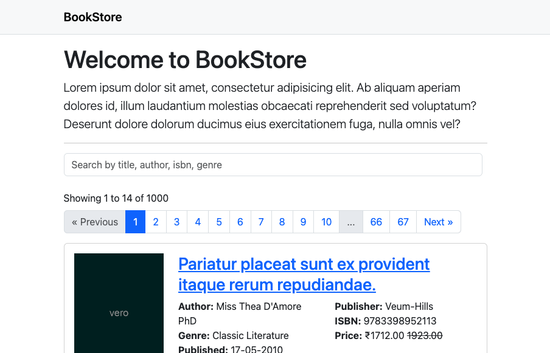

# BookStore App - Task

The BookStore App is a simple application developed with Laravel.

Requirement: https://drive.google.com/file/d/1MF9hVbmX7j1iBes2lJbMIY_MWPaNE2yT/view?usp=sharing



## Requirements

- PHP 8.2
- Composer 2.6
- MySQL
- Meilisearch
- Docker

## Getting Started

1. Clone the repository.
2. `cd` into `bookstor-app`.
3. Run `composer install`.
4. Rename or copy the `bookstore-app/.env-example` to `bookstore-app/.env`.
5. Update the `.env` with the database and scout credentials.
6. Run `./vendor/bin/sail up -d`.
7. Run `./vendor/bin/sail artisan migrate` to run the database migrations.
8. Storage link `./vendor/bin/sail artisan storage:link`.

### Admin Dashboard

Admin dashboard can be accessed on url `/admin`.
The admin login requires existing user so consider seeding data for testing.

> Seed with fake data by running `./vendor/bin/sail artisan migrate:fresh --seed`.
> With the seeder the default admin credentials are email and password are `admin@email.com` and `password`.

### API Endpoints

1. `/api/books` the index endpoint allows paginated search support with `q` and `page` as query parameters.
2. `/api/books/{book}` detail endpoint to get additional detail of a book.

## Infrastructure

Deployments are configured with a combination of tools and currently only supports adding application server setup. The
current deployment needs additional improvements to be made for production.

TODO:

- [ ] Meilisearch
- [ ] Supervisor

> Terraform provider will ask for the token while performing the operation.

- Terraform - Refer docs: https://developer.hashicorp.com/terraform/docs
- DigitalOcean Access Key. Refer docs: https://registry.terraform.io/providers/digitalocean/digitalocean/latest/docs

Running terraform plan.

```shell
terraform -chdir=./infra/terraform  plan -var-file=terraform.tfvars
```

Running terraform validate.

```shell
terraform -chdir=./infra/terraform validate
```

Running terraform apply.

```shell
terraform -chdir=./infra/terraform apply -auto-approve -var-file=terraform.tfvars
```

Running terraform destroy.

```shell
terraform -chdir=./infra/terraform destroy -auto-approve -var-file=terraform.tfvars
```